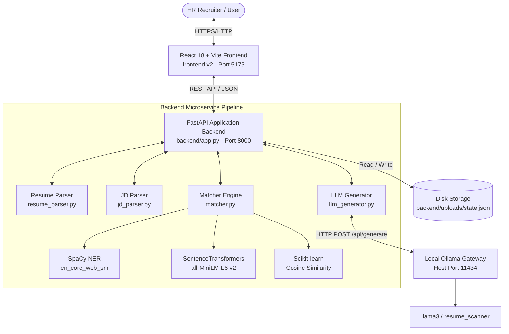
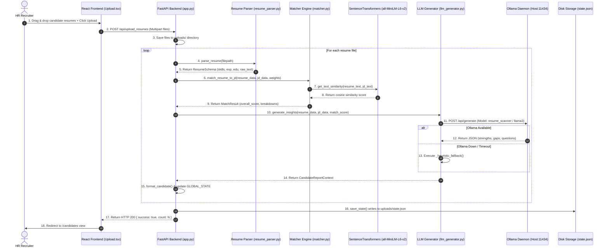

# FitScan — Comprehensive Technical Project Documentation

---

## 1. Project Overview

* **Project Name**: FitScan (AI Resume Scanner & HR Recruitment Platform)
* **Purpose**: FitScan is a full-stack automated recruitment and candidate evaluation engine. It enables human resources teams, recruiters, and hiring managers to parse, evaluate, rank, and shortlist job applicants against Job Description (JD) requirements.
* **Problem Solved**: Manual resume screening is slow, inconsistent, subject to unconscious bias, and creates severe candidate review bottlenecks. FitScan automates document parsing (`.pdf`, `.docx`, `.txt`), calculates objective match metrics using dual NLP and vector embedding engines, anonymizes candidate data to mitigate bias, and generates tailored behavioral interview questions without requiring cloud API keys.
* **Key Features**:
  1. **Multi-Format Document Parsing**: Automatic text and metadata extraction from PDF, DOCX, and TXT files.
  2. **Dual-Matching AI Engine**:
     - *Heuristic NLP*: Keyword and entity matching via SpaCy for skills, education, and years of experience.
     - *Semantic Vector AI*: Cosine similarity matching via SentenceTransformers (`all-MiniLM-L6-v2`) over high-dimensional text embeddings.
  3. **Local Offline LLM Inferencing**: Native Ollama integration (`llama3` / custom HR persona) to generate candidate fit summaries, key strengths, skill gap analyses, and personalized interview questions. Includes an offline heuristic fallback generator.
  4. **PII Anonymization Utility**: Regex and spaCy NER pipeline for masking PII (email, phone, dates of birth, addresses, URLs, and candidate names).
  5. **Interactive Dashboard & Visualization**: Responsive React 18 + Vite + Tailwind CSS dashboard with score breakdown progress rings, metric charts, and shortlist management.
  6. **Data Persistence & Reporting**: File-backed state storage (`uploads/state.json`) and instant exports to PDF (ReportLab) and Excel (`openpyxl` / `pandas`).
  7. **Containerized Deployment**: 1-click Docker Compose setup linking microservices and host LLM gateways.
* **Main Use Cases**:
  - High-volume resume screening for tech and non-tech roles.
  - Objective candidate ranking based on weighted skill/experience/education ratios.
  - Interview preparation via auto-generated candidate-specific interview questions.
  - Blind recruitment evaluation via anonymized PII masking.
* **Who/What Uses the Project**: HR Recruiters, Talent Acquisition Leads, Hiring Managers, and Automated Microservices interfacing via REST API.

---

## 2. High-Level Architecture

FitScan follows a microservice-oriented, decoupled client-server architecture with separate frontend and backend containers and a local LLM inferencing gateway.

### Architecture Overview

1. **Client Layer (`frontend v2`)**: Single Page Application built with React 18, Vite, TypeScript, and Tailwind CSS. It handles UI rendering, state management, drag-and-drop file uploads, and interactive visualizations.
2. **API & Engine Layer (`backend`)**: FastAPI application acting as the orchestrator. It exposes RESTful endpoints, coordinates resume/JD parsers, calculates match metrics, and manages persistent state.
3. **NLP & Vector Embedding Layer**: Embedded Python libraries (`spaCy` for NER, `sentence-transformers` for 384-dimensional vector embeddings, and `scikit-learn` for cosine similarity).
4. **LLM Inferencing Gateway (Ollama)**: Local Ollama daemon running on host machine port `11434`, supplying generative inferences (`resume_scanner` or `llama3`).
5. **Persistence Layer**: Disk-backed storage in `backend/uploads/` storing binary upload files and `state.json` metadata.

### Architecture Diagram



---

## 3. Project Structure

```text
FitScan/
├── .gitignore                       # Root Git ignore rules (node_modules, venvs, uploads)
├── README.md                        # High-level user & quickstart documentation
├── docker-compose.yml               # Multi-container Docker orchestration script
├── backend/                         # FastAPI Python Backend Application
│   ├── Dockerfile                   # Python 3.10-slim Docker build environment
│   ├── Modelfile                    # Ollama model definition file with HR persona system prompt
│   ├── anonymizer.py                # PII masking module (Regex + spaCy NER)
│   ├── app.py                       # Main FastAPI application, routing, and state persistence
│   ├── create_labels.py             # Ground-truth dataset label generator for Excel evaluation
│   ├── jd_parser.py                 # Job Description parsing and skill classification module
│   ├── llm_generator.py             # Ollama API client & heuristic fallback question generator
│   ├── matcher.py                   # Heuristic & vector embedding cosine similarity matching engine
│   ├── requirements.txt             # Python dependency list
│   └── resume_parser.py             # Resume parsing, contact extraction, & section splitter module
├── data/                            # Dataset directory
│   ├── anon_report.csv              # Anonymization audit report
│   ├── jds/                         # Job Description raw and parsed files
│   └── parsed_resumes/              # Output JSON parsed resume cache
└── frontend v2/                     # React 18 + TypeScript + Vite Dashboard Frontend
    ├── Dockerfile                   # Node 18-alpine Docker build environment
    ├── README.md                    # Frontend documentation
    ├── eslint.config.js             # ESLint configuration
    ├── index.html                   # HTML5 entry point
    ├── package.json                 # Node package manifest & dependencies
    ├── postcss.config.js            # PostCSS configuration for Tailwind
    ├── tailwind.config.js           # Tailwind CSS design system configuration
    ├── tsconfig.json                # TypeScript project references
    ├── tsconfig.app.json            # TypeScript frontend app compiler options
    ├── tsconfig.node.json           # TypeScript Node environment compiler options
    ├── vite.config.ts               # Vite build tool and dev server configuration
    ├── public/                      # Static assets (favicons, SVG logos)
    └── src/                         # Application source code
        ├── App.tsx                  # Root Outlet router component
        ├── index.css                # Global Tailwind CSS styles and font rules
        ├── main.tsx                 # React DOM entry point
        ├── components/              # UI & Layout components
        │   ├── LoginForm.tsx        # Login authentication form
        │   ├── ProtectedRoute.tsx   # Authenticated route wrapper guard
        │   ├── RegisterForm.tsx     # Registration form component
        │   ├── layout/
        │   │   ├── DashboardLayout.tsx # Main sidebar + navbar application frame
        │   │   ├── Navbar.tsx       # Top navigation header component
        │   │   └── Sidebar.tsx      # Side navigation drawer component
        │   └── ui/                  # Reusable atomic UI components
        │       ├── badge.tsx        # Status pill badge component
        │       ├── button.tsx       # Variant button component
        │       ├── card.tsx         # Content card container component
        │       ├── input.tsx        # Styled form text input
        │       ├── progress.tsx     # Progress bar component
        │       ├── skeleton.tsx     # Loading shimmer component
        │       └── toast.tsx        # Floating notification toast component
        ├── hooks/
        │   └── useTheme.ts          # Light/dark mode theme hook
        ├── pages/                   # Application pages / view controllers
        │   ├── Auth.tsx             # Authentication portal view
        │   ├── CandidateDetail.tsx  # Detailed candidate report & question view
        │   ├── Candidates.tsx       # Ranked candidate directory view
        │   ├── Dashboard.tsx        # Main analytics & activity feed dashboard
        │   ├── Login.tsx            # Login view component
        │   ├── Metrics.tsx          # Precision/recall confusion matrix view
        │   ├── Reports.tsx          # Report export controller view
        │   ├── Settings.tsx         # System weight configuration view
        │   └── Upload.tsx           # JD & Resume batch uploader view
        ├── routes/
        │   └── index.tsx            # React Router v6 browser router definitions
        ├── services/
        │   └── api.ts               # Axios API client service layer
        ├── types/
        │   └── index.ts             # Global TypeScript interface definitions
        └── utils/
            └── cn.ts                # Tailwind class merge utility (clsx + tailwind-merge)
```

---

## 4. Technology Stack

| Technology / Library | Version | Category | Purpose & Usage in Project |
| :--- | :--- | :--- | :--- |
| **Python** | 3.10+ | Language | Core backend language (`backend/app.py`, `resume_parser.py`, `matcher.py`). |
| **FastAPI** | ^0.100 | Web Framework | Asynchronous API server handling REST requests (`backend/app.py`). |
| **Uvicorn** | Latest | ASGI Server | Production HTTP server executing FastAPI application. |
| **Pydantic** | ^2.0 | Validation | Data schema definition and output serialization (`ResumeSchema`, `JDSchema`, `MatchResult`). |
| **SpaCy** | ^3.0 | NLP Engine | Named Entity Recognition (NER) & skill matching (`en_core_web_sm`). |
| **SentenceTransformers** | Latest | AI Embeddings | Generates 384-dimensional dense text vectors (`all-MiniLM-L6-v2`) in `matcher.py`. |
| **Scikit-learn** | Latest | Math Engine | Computes cosine similarity matrices between embedding vectors. |
| **PyPDF2 / pypdf** | Latest | Parser | Binary PDF text extraction from uploaded resume and JD files. |
| **python-docx** | Latest | Parser | Binary DOCX text extraction from Microsoft Word documents. |
| **ReportLab** | Latest | PDF Generator | Generates downloadable candidate PDF reports on demand (`/api/export`). |
| **OpenPyXL / Pandas** | Latest | Excel Generator | Generates candidate ranking spreadsheets (`.xlsx`) and dataframes. |
| **Ollama** | Local Host | Local LLM Gateway | Local offline LLM server interfacing with `llama3` for interview question generation. |
| **React** | ^18.2.0 | Frontend UI | Component-based user interface rendering (`frontend v2/src`). |
| **TypeScript** | ^5.9.3 | Type Safety | Frontend type contracts and compile-time error detection. |
| **Vite** | ^5.0.0 | Build Tool | Lightning-fast development server and production bundler. |
| **Tailwind CSS** | ^3.4.19 | Styling System | Utility-first responsive styling and dark mode support. |
| **Recharts** | ^3.7.0 | Charts | Data visualization for candidate score distributions and metrics. |
| **Lucide React** | ^0.575 | Icons | Modern SVG icon library used across all dashboard pages. |
| **Axios** | ^1.13.5 | HTTP Client | Frontend service layer for communicating with FastAPI (`frontend v2/src/services/api.ts`). |
| **Docker & Compose**| ^3.8 | Containerization| Microservice containerization and host port binding (`docker-compose.yml`). |

---

## 5. Detailed Component Explanation

### Backend Components

#### 1. `backend/app.py`
- **What it does**: Entry point for the FastAPI REST API server. Manages routing, global CORS policy, upload file storage, background parsing calls, report generation, and JSON disk state persistence (`save_state()` / `load_state()`).
- **Inputs**: Multipart form uploads (files), JSON payloads (text paste, settings updates), query parameters.
- **Outputs**: Structured JSON API responses, binary file streams (PDF/Excel exports).
- **Dependencies**: `resume_parser`, `jd_parser`, `matcher`, `llm_generator`, `reportlab`, `pandas`.

#### 2. `backend/resume_parser.py`
- **What it does**: Reads uploaded `.pdf`, `.docx`, or `.txt` resumes. Splits document into logical sections (skills, education, experience, projects, certifications), extracts candidate name (`extract_name`), contact email (`extract_email`), years of experience, degree, and matches skills against `SKILL_VOCAB`.
- **Inputs**: File path string to local uploaded resume file.
- **Outputs**: Serialized `ResumeSchema` dictionary containing parsed attributes and `raw_text`.

#### 3. `backend/jd_parser.py`
- **What it does**: Reads uploaded or pasted Job Descriptions. Extracts required experience range (e.g. `"3-5 years"`) and classifies extracted technical skills into `must_have_skills` vs `good_to_have` based on contextual keywords.
- **Inputs**: File path string to Job Description file.
- **Outputs**: Serialized `JDSchema` dictionary containing skill sets and `raw_text`.

#### 4. `backend/matcher.py`
- **What it does**: Evaluates candidate fit against a JD using a weighted formula. Computes skill match score, experience score, education score, and semantic cosine similarity score via `SentenceTransformer('all-MiniLM-L6-v2')`.
- **Inputs**: `resume_data` dict, `jd_data` dict, optional raw text strings, and custom weight settings.
- **Outputs**: Serialized `MatchResult` dictionary containing overall score (0-100) and metric breakdowns.

#### 5. `backend/llm_generator.py`
- **What it does**: Interfaces with local Ollama daemon. Queries `/api/tags` to auto-discover installed models (`resume_scanner`, `llama3`, `mistral`). Sends candidate summary and JD requirements to generate structured JSON insights (summary, strengths, gaps, interview questions). Includes a deterministic fallback generator `_build_fallback_questions`.
- **Inputs**: Candidate resume dict, JD dict, match score integer.
- **Outputs**: Serialized `CandidateReportContext` dict (summary, strengths, gaps, interview questions).

#### 6. `backend/anonymizer.py`
- **What it does**: Pre-processing utility that masks PII from resumes prior to feeding into public or shared models. Uses Regex and spaCy NER to replace emails (`MASKED_EMAIL`), phone numbers (`MASKED_PHONE`), names (`MASKED_NAME`), and locations (`MASKED_LOCATION`).
- **Outputs**: Anonymized `.txt` files and audit CSV report.

---

### Frontend Components (`frontend v2/src`)

#### 1. `services/api.ts`
- **What it does**: Centralized Axios HTTP client communicating with backend API endpoint `VITE_API_URL` (`http://localhost:8000/api`). Encapsulates all backend interactions.

#### 2. `pages/Upload.tsx`
- **What it does**: File drag-and-drop upload interface for Job Descriptions and batch candidate resumes. Supports PDF/DOCX file selection and text paste fallback.

#### 3. `pages/Candidates.tsx`
- **What it does**: Interactive table view of all parsed candidates. Supports filtering by recommendation level (All, Strong, Medium, Weak, Reject), searching, and direct candidate shortlist actions.

#### 4. `pages/CandidateDetail.tsx`
- **What it does**: Comprehensive deep-dive view for an individual candidate. Renders the SVG circular score progress indicator, breakdown bars, strengths list, skill gap list, AI summary, interview question checklist, and granular skill comparison table.

#### 5. `pages/Dashboard.tsx`
- **What it does**: High-level overview rendering metric card stats (Total Candidates, Strong Fit, Medium Fit, Weak Fit, Average Match Score) and real-time activity log feed.

#### 6. `pages/Reports.tsx` & `pages/Metrics.tsx`
- **What it does**: `Reports.tsx` handles downloading PDF/Excel recruitment reports. `Metrics.tsx` visualizes precision, recall, top-5 accuracy, and the model confusion matrix.

---

## 6. End-to-End Application Flow

### Resume Upload & Matching Execution Sequence



---

## 7. Tools and Integrations

| Tool / Integration | Purpose | How Invoked | Input | Output | Error Handling |
| :--- | :--- | :--- | :--- | :--- | :--- |
| **SpaCy** | Named Entity Recognition & Skill Tokenization | `nlp = spacy.load("en_core_web_sm")` | Raw document text string | Extracted entity tokens & skills | Returns empty skill list if model fails to load. |
| **SentenceTransformers** | Dense Vector Embeddings | `SentenceTransformer('all-MiniLM-L6-v2').encode()` | List of text strings `[resume, jd]` | 384-dimensional float NumPy vectors | Catches exception and falls back to default 50% score. |
| **Scikit-learn** | Vector Cosine Similarity | `cosine_similarity([vec1], [vec2])` | Two 384-dim NumPy float vectors | Float matrix scalar `[-1.0 to 1.0]` | Scaled to 0-100 integer score. |
| **Ollama Local LLM** | Generative candidate evaluation | `requests.post("http://host:11434/api/generate")` | Prompt with skills, exp & JD requirements | JSON object with summary, strengths, questions | 3-second connection timeout; triggers heuristic fallback. |
| **ReportLab** | PDF Report Compilation | `canvas.Canvas(output_buffer)` | Candidate list & scores | Binary PDF byte buffer | Returns empty formatted canvas if candidate list empty. |
| **OpenPyXL** | Excel Spreadsheet Generation | `pd.ExcelWriter(buffer, engine='openpyxl')` | Candidate pandas DataFrame | Binary `.xlsx` byte buffer | Streams empty spreadsheet schema if list empty. |

---

## 8. APIs and Interfaces

### Base URL: `http://localhost:8000/api`

#### 1. Upload Job Description
- **Endpoint**: `POST /api/upload_jd`
- **Content-Type**: `multipart/form-data`
- **Parameters**: `file`: UploadFile (PDF, DOCX, TXT)
- **Response**:
  ```json
  {
    "success": true,
    "message": "Job Description uploaded and processed successfully"
  }
  ```

#### 2. Upload Job Description (Text Paste)
- **Endpoint**: `POST /api/upload_jd_text`
- **Content-Type**: `application/json`
- **Payload**:
  ```json
  { "text": "Senior Python Developer required with 5+ years experience in FastAPI..." }
  ```
- **Response**:
  ```json
  {
    "success": true,
    "message": "Job Description text uploaded and processed successfully"
  }
  ```

#### 3. Upload Candidate Resumes
- **Endpoint**: `POST /api/upload_resumes`
- **Content-Type**: `multipart/form-data`
- **Parameters**: `files`: List[UploadFile]
- **Response**:
  ```json
  {
    "success": true,
    "message": "Resumes uploaded successfully",
    "count": 5
  }
  ```

#### 4. List Candidates
- **Endpoint**: `GET /api/candidates`
- **Query Parameters**: `filter` (optional): `"all"`, `"strong"`, `"medium"`, `"weak"`, `"reject"`
- **Response**: List of candidate objects.

#### 5. Get Candidate Details
- **Endpoint**: `GET /api/candidates/{id}`
- **Response**:
  ```json
  {
    "id": "resume_001",
    "name": "Jane Doe",
    "email": "jane@example.com",
    "matchScore": 85,
    "experience": 5,
    "topMatchedSkills": ["python", "fastapi", "docker"],
    "missingSkills": ["kubernetes"],
    "recommendation": "Strong",
    "shortlisted": true,
    "strengths": ["Strong match in core skills: python, fastapi"],
    "skillGaps": ["Missing required skills: kubernetes"],
    "summary": "Candidate scored 85/100. Highly recommended strong fit.",
    "interviewQuestions": [
      "How would you approach learning or implementing Kubernetes in a production environment?",
      "Can you explain how you leveraged Python to optimize performance in a past role?"
    ],
    "experienceMatch": 100,
    "skillMatch": 80,
    "educationMatch": 90,
    "skillComparison": [
      { "skill": "python", "candidateHas": true, "matchScore": 100 },
      { "skill": "kubernetes", "candidateHas": false, "matchScore": 0 }
    ]
  }
  ```

#### 6. Export Reports
- **Endpoint**: `GET /api/export`
- **Query Parameters**: `type` (`"full_ranking"` or `"shortlist"`), `format` (`"pdf"` or `"excel"`)
- **Response**: Binary file download stream (`application/pdf` or `application/vnd.openxmlformats-officedocument.spreadsheetml.sheet`).

#### 7. System Settings
- **Endpoint**: `GET /api/settings` & `POST /api/settings`
- **Payload**:
  ```json
  {
    "weights": { "experience": 30, "skills": 50, "education": 20 }
  }
  ```

---

## 9. Data Flow

```text
Upload (PDF/DOCX/TXT) 
   │
   ├─► Read binary buffer (PyPDF2 / python-docx)
   │     └─► Raw Text String
   │
   ├─► Section Splitter & Tokenizer (resume_parser.py / jd_parser.py)
   │     ├─► Extract Skills (Regex against SKILL_VOCAB)
   │     ├─► Extract Experience (Year regex & date span math)
   │     ├─► Extract Education (Degree keywords)
   │     ├─► Extract Contact Email & Name
   │     └─► Struct JSON (ResumeSchema / JDSchema)
   │
   ├─► Match Engine (matcher.py)
   │     ├─► Skill Heuristic Ratio (70% Must-Have / 30% Good-To-Have)
   │     ├─► Experience Score Formula
   │     ├─► Education Degree Level Score
   │     ├─► SentenceTransformer Vector Encoding & Cosine Similarity
   │     └─► MatchResult JSON (Weighted Overall Score)
   │
   ├─► LLM Generator (llm_generator.py)
   │     ├─► Query Ollama Local Daemon
   │     └─► CandidateReportContext JSON (Strengths, Gaps, Questions)
   │
   └─► State Persistence & API Response (app.py)
         ├─► Save to backend/uploads/state.json
         └─► Return formatted Candidate object to React Dashboard
```

---

## 10. Database / Storage

* **Storage Engine**: File-backed JSON Storage (`backend/uploads/state.json`).
* **Schema Structure**:
  ```json
  {
    "current_jd": { "jd_id": "...", "must_have_skills": [...], "raw_text": "..." },
    "candidates": {
      "candidate_id_1": { /* Candidate Object */ },
      "candidate_id_2": { /* Candidate Object */ }
    },
    "activities": [
      { "id": "...", "type": "resume_uploaded", "message": "...", "timestamp": "..." }
    ],
    "settings": {
      "weights": { "experience": 30, "skills": 50, "education": 20 }
    }
  }
  ```
* **Lifecycle**: Uploaded document files are stored in `backend/uploads/`. State is loaded automatically at FastAPI startup (`load_state()`) and written on every mutation (`save_state()`).

---

## 11. Configuration and Environment

### Environment Variables

| Variable Name | Default Value | Description | Used In |
| :--- | :--- | :--- | :--- |
| `OLLAMA_HOST` | `localhost` | Host address of local Ollama service (`host.docker.internal` inside Docker). | `backend/llm_generator.py` |
| `VITE_API_URL` | `http://localhost:8000/api` | Base URL for API requests from the frontend client. | `frontend v2/src/services/api.ts` |
| `PORT` | `8000` / `5175` | Port numbers exposed by FastAPI backend and Vite frontend. | `docker-compose.yml` |

### Sample `.env.example`
```env
# Backend Environment Settings
OLLAMA_HOST=localhost
PORT=8000

# Frontend Environment Settings
VITE_API_URL=http://localhost:8000/api
```

---

## 12. Installation and Setup

### Prerequisites
- **Python**: 3.10 or higher
- **Node.js**: v18.0 or higher
- **Docker**: Docker Desktop (optional for containerized execution)
- **Ollama**: Installed locally with `llama3` model

### Local Development Setup Step-by-Step

#### 1. Clone & Setup Backend
```bash
cd backend
python -m venv venv

# Activate virtual environment
# Windows:
.\venv\Scripts\activate
# macOS/Linux:
source venv/bin/activate

pip install -r requirements.txt
python -m spacy download en_core_web_sm
```

#### 2. Setup Ollama Model
```bash
ollama run llama3
# In a new terminal:
ollama create resume_scanner -f backend/Modelfile
```

#### 3. Run Backend API Server
```bash
uvicorn app:app --host 0.0.0.0 --port 8000 --reload
```

#### 4. Setup & Run Frontend Client
```bash
cd "../frontend v2"
npm install
npm run dev
```
Open web browser at `http://localhost:5175`.

---

## 13. Build, Run and Deployment

### Production Docker Deployment

Run the complete multi-container stack via Docker Compose:

```bash
docker-compose up --build -d
```

- **Frontend Container**: Listens on port `5175` (bound to `0.0.0.0`).
- **Backend Container**: Listens on port `8000` (bound to `0.0.0.0`).
- **Volume Mount**: Maps `./backend/uploads` host folder to `/app/uploads` container path for data persistence.

---

## 14. Error Handling and Edge Cases

1. **Ollama Down / Unreachable**: `llm_generator.py` catches connection errors with a 3-second connect timeout and executes `_heuristic_fallback()` to generate candidate questions deterministically without crashing.
2. **Missing PDF/Word Libraries**: `resume_parser.py` and `jd_parser.py` wrap imports in `try/except ImportError` blocks to provide clear error messages.
3. **Empty / Scanned PDF**: PyPDF2 text extraction returns `""` gracefully without crashing.
4. **Duplicate Candidate File Uploads**: `app.py` generates unique candidate IDs to prevent overwriting existing candidate records.
5. **No Skills Detected in JD**: `jd_parser.py` falls back to selecting top extracted tech terms to ensure match comparison functions properly.

---

## 15. Security

- **PII Anonymization**: `anonymizer.py` provides regex + spaCy NER masking for emails, phone numbers, addresses, and candidate names.
- **Local Privacy**: AI inferencing is performed 100% locally via Ollama. No candidate resumes or PII are transmitted to external third-party cloud LLMs (e.g. OpenAI/Claude).
- **CORS Management**: Configured in `app.py` via FastAPI `CORSMiddleware`.
- **Input Validation**: All incoming API requests are strictly typed and validated via Pydantic schemas.

---

## 16. Testing

- **Python Syntax & Compilation**:
  ```bash
  python -m py_compile backend/app.py backend/resume_parser.py backend/jd_parser.py backend/matcher.py backend/llm_generator.py
  ```
- **Frontend Vite Build Verification**:
  ```bash
  cd "frontend v2"
  npm run build
  ```
- **Ground Truth Evaluation**: `backend/create_labels.py` generates an Excel evaluation dataset (`ground_truth_labels.xlsx`) for manual reviewer scoring against model recommendations.

---

## 17. Important Implementation Details

### Match Score Calculation Formula

Overall candidate match score is calculated in `matcher.py`:

$$\text{Overall Score} = (\text{Skill Score} \times W_{\text{skills}}) + (\text{Experience Score} \times W_{\text{exp}}) + (\text{Education Score} \times W_{\text{edu}})$$

Default weights: $W_{\text{skills}} = 0.50$, $W_{\text{exp}} = 0.30$, $W_{\text{edu}} = 0.20$.

#### Skill Score Sub-Formula:
- **Must-Have Skills**: Weight $70\%$
- **Good-To-Have Skills**: Weight $30\%$

#### Education Score Mapping:
- **PhD / Doctorate**: 100%
- **Master's / MBA / M.Tech**: 90%
- **Bachelor's / B.Tech / B.E**: 75%
- **Diploma / Associate**: 60%
- **Unknown**: 40%

---

## 18. Known Limitations / Technical Debt

1. **OCR for Image-Based PDFs**: PyPDF2 extracts text from binary streams. Scanned image-based PDFs without OCR text layers yield empty text strings. (Future enhancement: Integrate `pytesseract` or `pdfplumber`).
2. **In-Memory State Scaling**: `state.json` is sufficient for single-recruiter usage. Large-scale multi-tenant deployments should migrate `GLOBAL_STATE` to SQLite/PostgreSQL.
3. **Hardcoded Tech Vocabulary**: `SKILL_VOCAB` in `resume_parser.py` contains 70 predefined technology terms. Non-tech terms rely primarily on direct JD keyword extraction.

---

## 19. Troubleshooting Guide

| Symptom | Possible Cause | Solution |
| :--- | :--- | :--- |
| **Frontend fails to connect to API** | `VITE_API_URL` incorrect or backend port 8000 blocked. | Verify backend is running at `http://localhost:8000` and check CORS settings. |
| **Docker container frontend refused connection** | Vite bound to `127.0.0.1` inside container. | Ensure `vite.config.ts` includes `server: { host: '0.0.0.0', port: 5175 }`. |
| **Candidate report missing AI questions** | Ollama offline or model missing. | Run `ollama run llama3` and `ollama create resume_scanner -f backend/Modelfile`. |
| **`ModuleNotFoundError: No module named 'spacy'`** | Missing Python dependencies. | Run `pip install -r requirements.txt` and `python -m spacy download en_core_web_sm`. |

---

## 20. Developer Quick Reference

### Quick Commands

```bash
# Start Docker Stack
docker-compose up --build

# Run Backend Server Locally
cd backend && uvicorn app:app --reload --port 8000

# Run Frontend App Locally
cd "frontend v2" && npm run dev

# Re-create Ollama HR Model
ollama create resume_scanner -f backend/Modelfile
```

### Key File Locations
- **Backend API Routes**: [backend/app.py](file:///c:/Users/haris/Downloads/FitScan/FitScan/backend/app.py)
- **Resume Parsing Rules**: [backend/resume_parser.py](file:///c:/Users/haris/Downloads/FitScan/FitScan/backend/resume_parser.py)
- **Vector & Heuristic Matcher**: [backend/matcher.py](file:///c:/Users/haris/Downloads/FitScan/FitScan/backend/matcher.py)
- **LLM Generator & Fallbacks**: [backend/llm_generator.py](file:///c:/Users/haris/Downloads/FitScan/FitScan/backend/llm_generator.py)
- **Frontend API Client**: [frontend v2/src/services/api.ts](file:///c:/Users/haris/Downloads/FitScan/FitScan/frontend%20v2/src/services/api.ts)
- **Candidate Detail View**: [frontend v2/src/pages/CandidateDetail.tsx](file:///c:/Users/haris/Downloads/FitScan/FitScan/frontend%20v2/src/pages/CandidateDetail.tsx)
- **Docker Compose File**: [docker-compose.yml](file:///c:/Users/haris/Downloads/FitScan/FitScan/docker-compose.yml)
